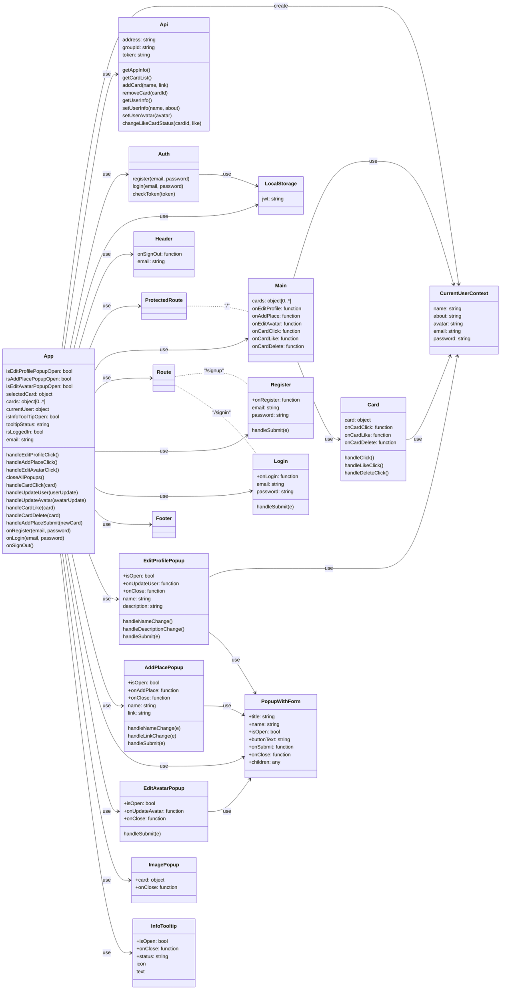
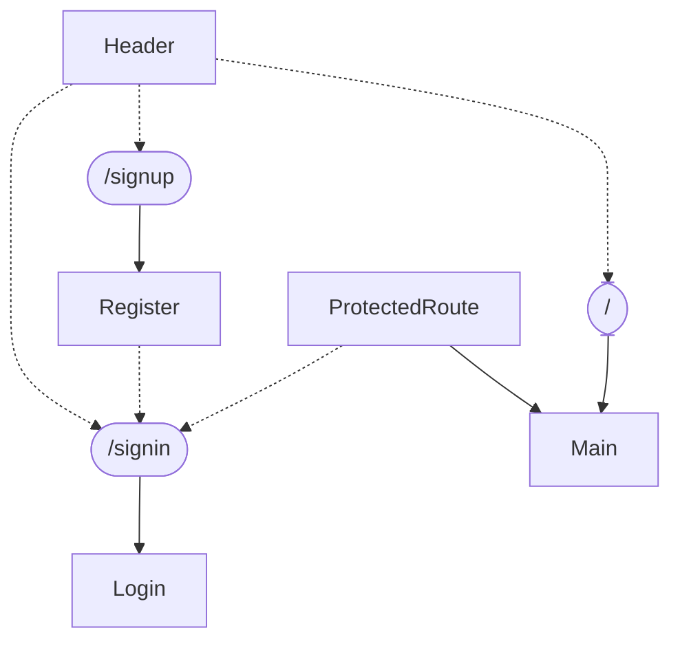
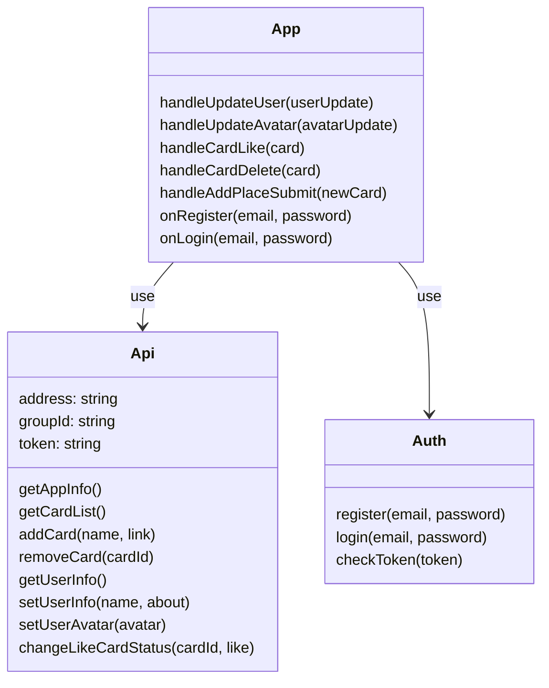

## Задача 1

Необходимо разделить проект Mesto на несколько микрофронтендов. Самостоятельно решите, какой фреймворк будете использовать, — Module Federation или Single SPA.

> [!NOTE] Цель разделения
> Поскольку в условиях задачи не определена цель разделения, то зададим её самостоятельно. Условимся считать, что целью является повышение организационной гибкости и обеспечение возможности выпускать релизы отдельных бизнес-функций независимо друг от друга.

### Анализ проекта
#### Структура проекта

- `public` — статические ресурсы, включая `index.html`
- `src` — исходный код веб-приложения
	- `blocks` — каскадные таблицы стилей компонентов
	- `components` — React-компоненты
	- `contexts/CurrentUserContext` — объект React-контекста для хранения информации из профиля текущего пользователя
	- `images` — иконки и другие изображения используемые в приложении
	- `utils` — модули реализующие функции вызова API сервера приложений
	- `vendor` — шрифты и общие таблицы стилей

#### Компоненты и модули

#### Маршрутизация

#### Зависимости проекта

- react 17.0.2
- react-dom 17.0.2
	- index.js
- react-router-dom 5.2.0
	- index.js
	- App.js
	- Header.js
	- ProtectedRoute.js
	- Register.js
- react-scripts 4.0.3
- web-vitals 1.0.1 — не используется

#### Утилиты и вспомогательные функции

#### Стили и их организация

```mermaid
classDiagram
	direction LR
	class index.css {
		<<file>>
	}
	index.css --> normalize.css: use
	index.css --> font.css: use
	index.css --> page.css: use
	index.css --> header.css: use
	index.css --> content.css: use
	index.css --> footer.css: use
	index.css --> profile.css: use
	index.css --> places.css: use
	index.css --> card.css: use
	index.css --> popup.css: use
	index.css --> popup_is-opened.css: use
	index.css --> auth-form.css: use
	class normalize.css {
		<<file>>
	}
	class font.css {
		<<file>>
	}
	class page.css {
		<<file>>
		page
		page__content
		page__section
	}
	page.css ..> App
	page.css ..> Footer
	page.css ..> Header
	page.css ..> Main
	class header.css {
		<<file>>
		header
		header__logo
		header__auth-link
		header__wrapper
		header__user
		header__logout
	}
	header.css ..> Header
	class content.css {
		<<file>>
		content
	}
	content.css ..> Main
	class footer.css {
		<<file>>
		footer
		footer__copyright
	}
	footer.css ..> Footer
	class profile.css {
		<<file>>
		profile
		profile__description
		profile__add-button
		profile__edit-button
		profile__info
		profile__title
		profile__image
	}
	profile.css ..> Main
	class places.css {
		<<file>>
		places
		places__list
		places__item
	}
	places.css ..> Main
	places.css ..> Card
	class card.css {
		<<file>>
		card
		card__description
		card__image
		card__like-button
		card__like-button_is-active
		card__delete-button
		card__delete-button_hidden
		card__delete-button_visible
		card__title
		card__like-count
	}
	card.css ..> Card
	class popup.css {
		<<file>>
		popup
		popup__content
		popup__content_content_image
		popup__close
		popup__title
		popup__form
		popup__input
		popup__input_type_error
		popup__button
		popup__button_disabled
		popup__caption
		popup__image
		popup__label
		popup__error
		popup__error_visible
		-popup_type_remove-card
		-popup_type_edit-avatar
		popup__icon
		popup__status-message
	}
	popup.css ..> AddPlacePopup
	popup.css ..> EditAvatarPopup
	popup.css ..> EditProfilePopup
	popup.css ..> ImagePopup
	popup.css ..> InfoTooltip
	popup.css ..> PopupWithForm
	class popup_is-opened.css {
		<<file>>
		popup_is-opened
	}
	popup_is-opened.css ..> ImagePopup
	popup_is-opened.css ..> InfoTooltip
	popup_is-opened.css ..> PopupWithForm
	class auth-form.css {
		<<file>>
		auth-form
		auth-form__title
		auth-form__form
		auth-form__input
		auth-form__textfield
		auth-form__button
		auth-form__text
		auth-form__link
	}
	auth-form.css ..> Login
	auth-form.css ..> Register
```

### Определение границ микрофронтендов

На основании результатов анализа проекта предлагается разделить приложение на три микрофронтенда, используя вертикальную нарезку в качестве стратегии проектирования.

1. `auth-microfrontend` — регистрация и аутентификация пользователей
2. `profile-microfrontend` — взаимодействие с профилем текущего пользователя
3. `place-microfrontend` — взаимодействие с каталогом мест

### Выбор метода интеграции микрофронтендов

Исходя из поставленной цели разделения приложения — повышение организационной гибкости и обеспечение возможности выпускать релизы отдельных бизнес-функций независимо друг от друга, для интеграции микрофронтендов подходит `run time` метод.

Метод `run time` интеграции позволит:
- Развёртывать модули независимо
- Динамически обновлять отдельные модули

### Выбор метода композиции микрофронтендов

В качестве метода композиции микрофронтендов будет использован метод клиентской композиции. Этот подход позволяет создавать богатый интерактивный пользовательский опыт, который необходим для приложения Mesto.

### Выбор инструмента для создания микрофронтендов

В качестве инструмента для создания микрофронтендов будет использован Webpack Module Federation. Данное решение позволит достигнуть поставленной цели, а также избежать дублирования зависимостей.
